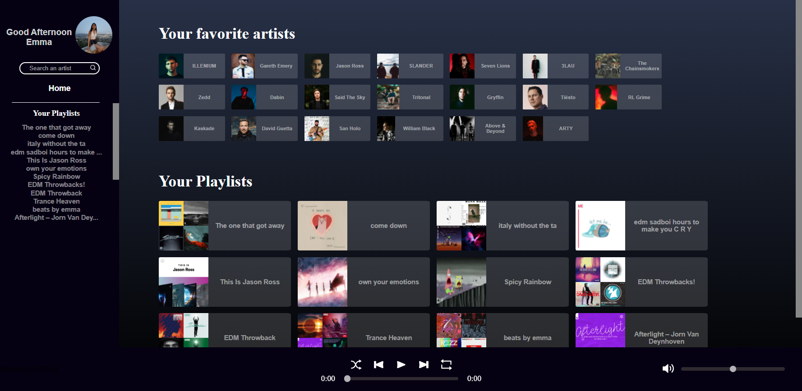
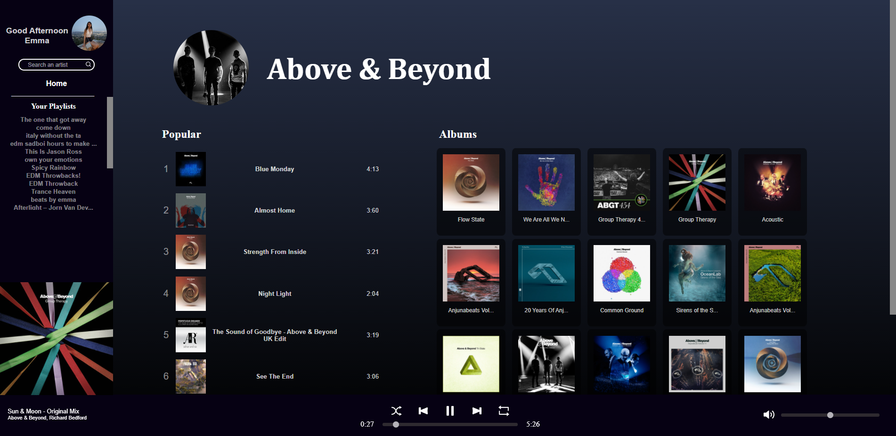
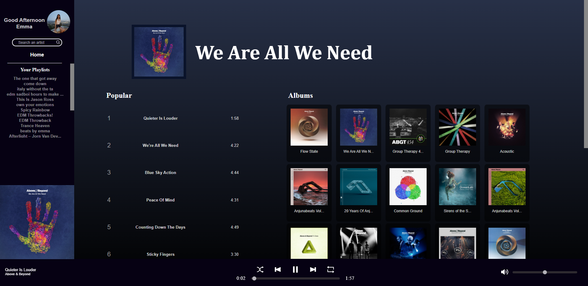

# Spectral Music

Spectral Music is a spotify clone that has a different UI layout that you're use to! 
This project was build using mostly React.js and Node/Express.js

# Features

- Search and view your favorite Artists and albums 
- View your playlists 
- The ability to play and control music you want to listen to 

# Images

Landing page after the user logs in

When the user views an artist

When the user views an album
