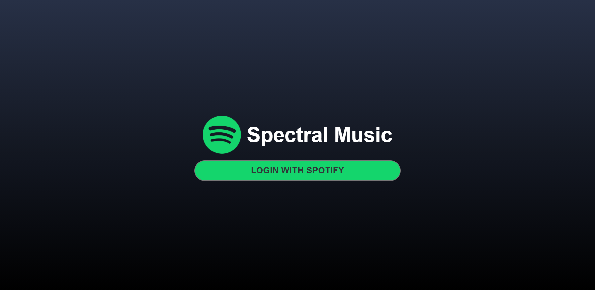

# Spectral Music

Spectral Music is a spotify clone that has a different UI layout that you're use to!   
This project was build using mostly React.js and Node/Express.js

# Features

- Search and view your favorite Artists and albums 
- View your playlists 
- The ability to play and control music you want to listen to 

# Images

Landing page after the user logs in

When the user views an artist

When the user views an album

# Things I learned when building this

This was my first ever project I've built and I learned A LOT during this process.  
Here are the main things that I learned:  
- React.js
- Node.js / Express.js
- OAuth
- API calling 

It was a really rewarding process to struggle through and learn everything.  
I spent a lot of time doing things that were not efficient whatsoever and slowly refactoring my code to work easier with the rest of my components.  

